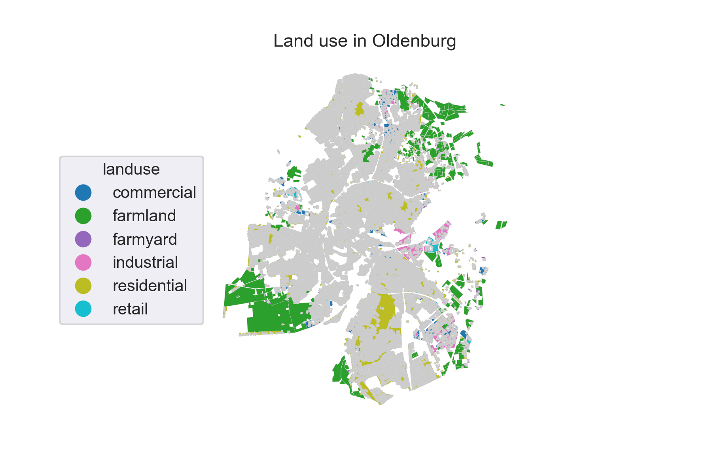
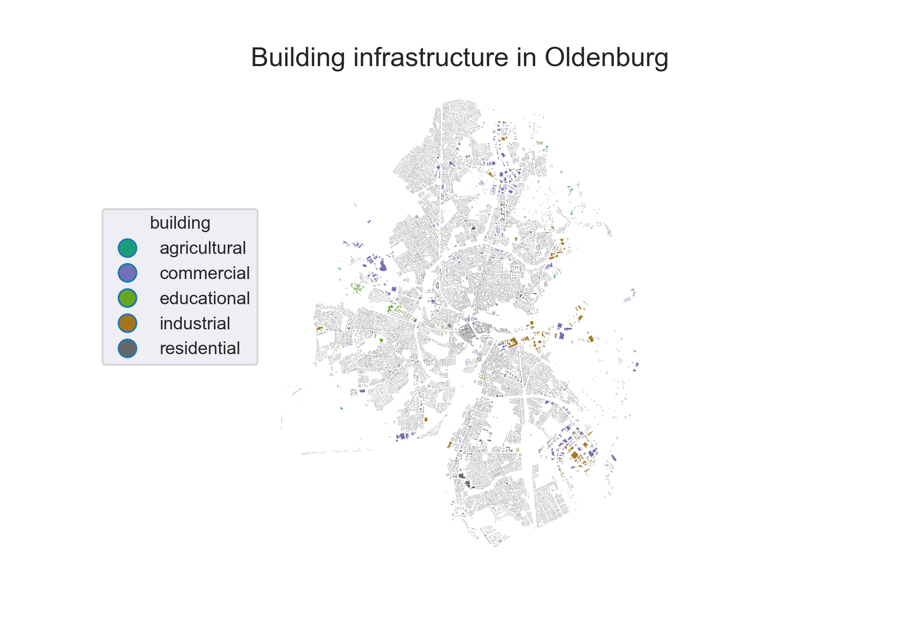
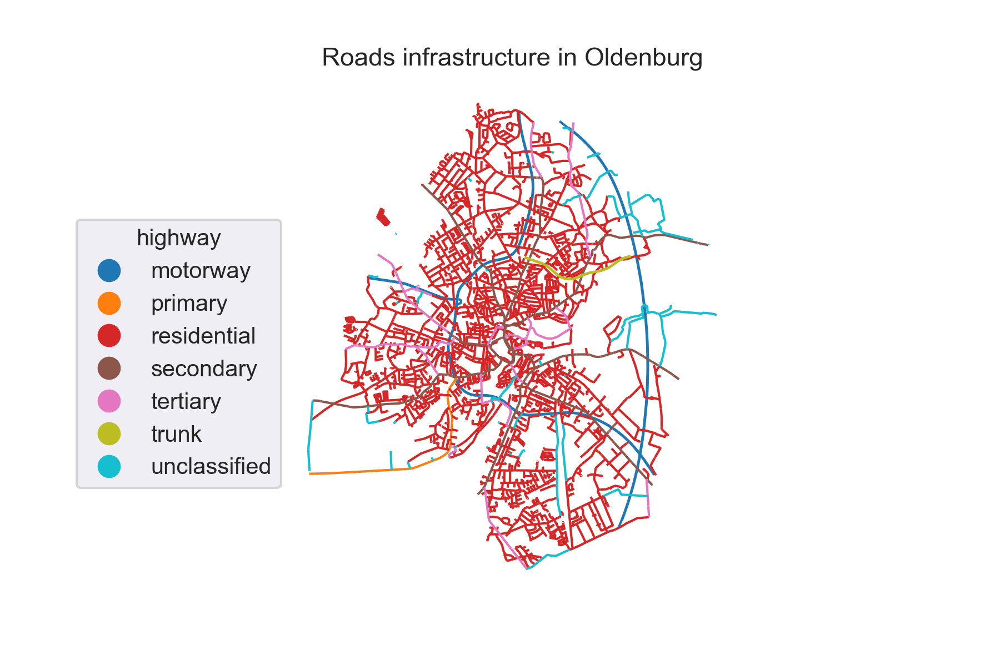
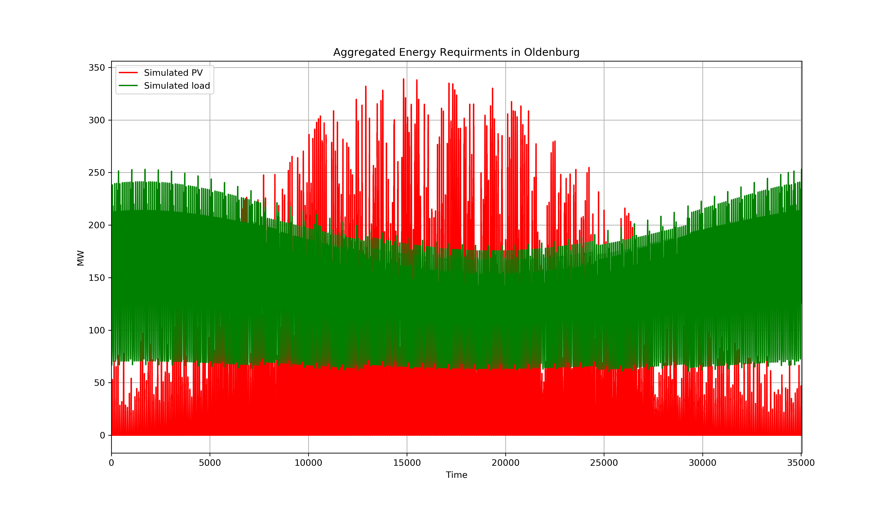
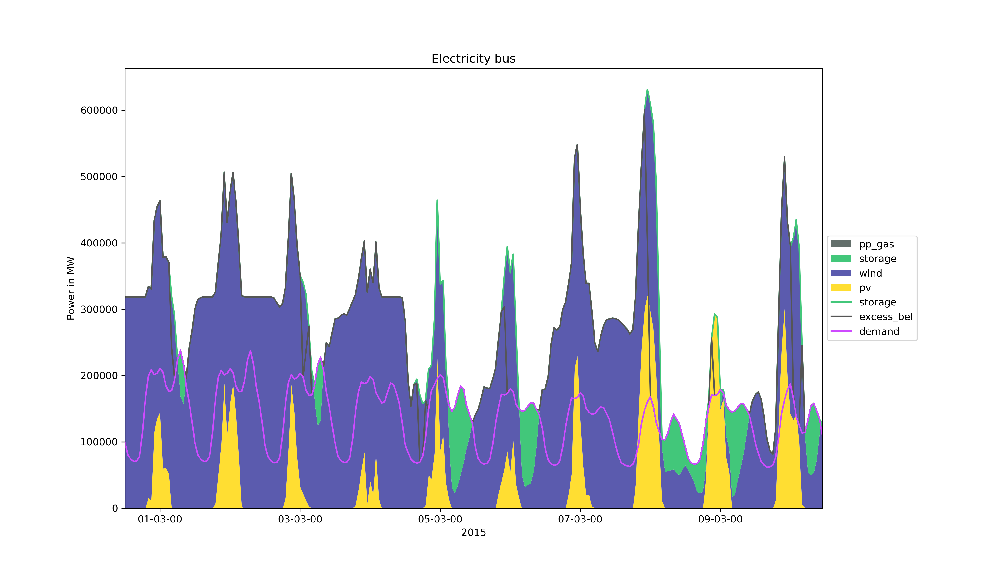

# FlexiGIS: an open source GIS-based platform for modelling energy systems and flexibility options in urban areas.

FlexiGIS stands for Flexibilisation in Geographic Information Systems (GIS). It extracts, filters and categorises the geo-referenced urban energy infrastructure, simulates the local electricity consumption and power generation from on-site renewable energy resources, and allocates the required decentralised storage in urban settings. FlexiGIS investigates systematically different scenarios of self-consumption, it analyses the characteristics and roles of flexibilisation technologies in promoting higher autarky levels in cities. The extracted urban energy infrastructure are based mainly on OpenStreetMap data.

[](https://flexigis.readthedocs.io/en/latest/?badge=latest)[](https://doi.org/10.5281/zenodo.4497334)

# FlexiGIS Components

## Module I: FlexiGIS urban spatial platform

This package establishes urban energy infrastructure. It extracts, acquires and processes urban georeferenced data extracted from OpenStreetMap. In order to extract the OpenStreetMap georeferenced datasets of urban energy infrustructure datasets and its required features, Module I derives an automatised extraction procedure. Firstly, the raw OpenStreetMap data is downloaded from the OpenStreetMap database for the invistigated urban space from `Geofabrik`. Second, the OpenStreetMap datasets are filtered for the respective case study defined by the provided `.POLY` file using the open source java tool `osmosis`. The OpenStreetMap data are filtered for the follwoing OSM elements:

- `landuse = *` tag provides information about the human use of land in the respective area (see [Figure 1](data/04_Visualisation/landuse.png))
- `building = *` tag describes all mapped objects considered as buildings of different categories, example residential, schools, etc. (see [Figure 2](data/04_Visualisation/buildings.png))
- `highway = *` tag describes all lines considered as streets, roads, paths, etc. (see [Figure 3](data/04_Visualisation/highway.png))
  
  Fig. 1. Extracted OpenStreetMap `landuse` datasets for the city of Oldenburg. Credits: OpenStreetMap contributors.
  
  Fig. 2. Extracted OpenStreetMap `building` datasets for the city of Oldenburg. Credits: OpenStreetMap contributors.
  
  Fig. 3. Extracted OpenStreetMap `highway` datasets for the city of Oldenburg. Credits: OpenStreetMap contributors.

After filtering the OSM raw data, the georeferenced building and roard infrastructure in the city of Oldenburg are exported to a relational postgis-enabled database using the open source `osm2pgsql`. Theses datasets can be exported as CSV files or visualised as maps (see Figures 1-3).

## Module II: FlexiGIS temporal dimension

It simulates urban energy requirments (consumption and generation). The spatio-temporal electricity consumption and renewable energy generation from PV and wind in the defined urban area are modelled. This component models the combined spatial parameters of urban geometries (Module I) and linkes them to real-world applications using GIS. Here, a bottom-up simulation approach is developed to calculate local urban electricity demand and power generation from available renewable energy resources. For instance, using open source datases like Standardised Load Profiles and publicaly available weather data, [ Figure 4 ](data/04_Visualisation/Energy_Requirments.png) shows the generated quarter-hourly time series of the aggregated load and PV power supply profile for invistigated case study. The PV and wind power supply are simulated using [feedinlib](https://feedinlib.readthedocs.io/en/latest/) python package.


Fig. 4. Simulated electricity consumption (green) and solar power generation (red) for the city of Oldenburg.

## Module III: Optimisation of flexibility options

The spatial-temporal simulation outputs from Module I and II are time series of electricity demand and supply. Theses generated datasets will be used by the [oemof/solph](https://oemof-solph.readthedocs.io/en/latest/index.html) model as inputs to the linear optimisation problem. This module aims to determine the minimum system costs at the given spatial urban scale while matching simultenously the simulated electricity demand. In addition, it aims to allocate and optimise distributed storage and other flexibility options in urban energy systems.

Fig. 5. Example result of optimal energy requirements, which minimize investement cost simulated for the city of Oldenburg.

## System requirements

FlexiGIS is developed and tested on Linux (Ubuntu 16.04.6). The tools and software used in FlexiGIS and their versions are listed in the following:

- Operating system: Ubuntu 16.04.6 LTS, Release: 16.04, Codename: xenial
- PostgreSQL version: 11.2 (64-bit)
- PostGIS version: 1.5.3
- osmosis version: 0.44.1
- osm2pgsql version: 0.88.1 (64bit id space)
- GNU Make version: 4.2.1
- Python: 3.6.7
- GNU bash: 4.3.48(1)-release (x86_64-pc-linux-gnu)

PostgreSQL: To install PostgreSQL, refer to the [PostgreSQL](http://www.postgresql.org/) webpag. Please note that you need at least the version or higher to run FlexiGIS.

Osmosis: To use [Osmosis](http://wiki.openstreetmap.org/wiki/Osmosis), unzip the distribution in the location of your choice. On unix/linux systems, make the bin/osmosis script executable (ie. chmod u+x osmosis). If desired, create a symbolic link to the osmosis script somewhere on your path (eg. ln -s appdir/bin/osmosis ~/bin/osmosis).

osm2pgsql: Instruction are available on how to download and install osm2pgsql for Linux systems on the [osm2pgsql](http://wiki.openstreetmap.org/wiki/Osm2pgsql) webpage.

Python: Ensure you can run python (with version 3 and above) on your OS. Python can be downloaded following this [link](https://www.python.org/downloads/) or download the [Anaconda](https://www.anaconda.com/distribution/) distro.

cbc solver: See [here](https://github.com/coin-or/Cbc) for cbc installation instruction.

## Getting Started

To use the FlexiGIS spatial-temporal platform download the FlexiGIS code and data folder as a zip file or clone the repository from the FlexiGIS GitHub repo. After downloading the FlexiGIS code, unzip the folder FlexiGIS in the location of your choice. The file structure of the FlexiGIS code folder is as follows:

- FlexiGIS
  - ├── code
  - ├── data
  - │   ├── 01_raw_input_data
  - │   ├── 02_urban_output_data
  - │   ├── 03_urban_energy_requirements
  - │   └── 04_Visualisation
  - ├── doc
  - ├── README.md
  - └── requirements.txt

## Installation

After making sure all system requirements are satisfied, clone FlexiGIS repo
create a Python virtual environment where the required python dependencies can be installed using Python virtual environment can be created by following the tutorial steps from [here](https://packaging.python.org/tutorials/installing-packages/).

First clone the FlexiGIS code from the GitHub repository. In the next step, create a Python virtual environment (give a name e.g. \_env_name) where the required python dependencies can be installed using pip, then activate the virtual environment.

```console
user@terminal:~$ git clone https://github.com/FlexiGIS/FlexiGIS.git
user@terminal:~$ python3 -m venv _env_name
user@terminal:~$ source _env_name/bin/activate
```

After creating and activativating the python virtual environment, cd into the cloned FlexiGIS directory, and install the required python dependencies.

```console
(_env_name) user@terminal:~$ cd ../FlexiGIS
(_env_name) user@terminal:~/FlexiGIS$ pip install -r requirements.txt
```

clone the [oemof/feedinlib](https://feedinlib.readthedocs.io/en/latest/) package from flexigis github repository(recommended) and install localy for the renewable feedin simulations. Also install the [oemof/solph](https://oemof-solph.readthedocs.io/en/latest/index.html) python package for the modelling and optimization of energy systems. An additional eomof package [oemof_visio](https://github.com/oemof/oemof-visio) is required as a dependency for generating nice plots of the optimization results.
**_Note: The default solver used here for the linear optimization by FlexiGIS is the cbc slover_**

```console
(_env_name) user@terminal:~/FlexiGIS$ git clone https://github.com/FlexiGIS/feedinlib.git
(_env_name) user@terminal:~/FlexiGIS$ pip install -e feedinlib
(_env_name) user@terminal:~/FlexiGIS$ pip install oemof.solph
(_env_name) user@terminal:~/FlexiGIS$ pip install git+https://github.com/oemof/oemof_visio.git
```

Now you are ready to excute FlexiGIS using the make commands.

## Running FlexiGIS

To run the first two components of the FlexiGIS package, execute the following steps:

1. After completing the setting up of FlexiGIS environment as mentioned in the steps above, go to the folder code, check the parameters in config.mk file.

2. Ensure that your database parameters are properly set in the config.mk file, and also the OSM data link of the spartial location of choice.

3. Ensure the poly file of the spartial location of choice is available in the data/01_raw_input_data directory before running FlexiGIS.

###### The available makefile options are:

To run the available makefile options, go into the code folder of the flexigis directory in your linux terminal, then run

```console
(_env_name) user@terminal:~/FlexiGIS/code$ make all
```

make-all executes multiple make options, from download to the simulation of load and PV profiles for the urban infrastructures, and finally the optimization of electricity supply and the alocated storage system. However, instead of running 'make all', you can run the various steps one after the other as decribed in the [documentation](https://flexigis.readthedocs.io/en/latest/flexigis_install/install.html#running-flexigis).

```console
(_env_name) user@terminal:~/FlexiGIS/code$ make weather_data
```

'make weather_data' downloads ECMWF ERA5 weather data of a location or region of interest from the climate data store ([CDS](https://cds.climate.copernicus.eu/#!/home)) using the feedinlib interface.

```console
(_env_name) user@terminal:~/FlexiGIS/code$ make feedin_data_format
```

'make feedin_data_format' prepares the dowloaded weather data into feedinlib format for feedin simulation.

```console
(_env_name) user@terminal:~/FlexiGIS/code$ make example
```

'make example' can be run to generate an example simulation of aggregated load and PV profile for Oldenburg and also model the optimal allocated storage and onsite renewable supply. The example imports spatially filtered OSM Highway, landuse and building data stored as csv files in the ../data/01_raw_input_data/example_OSM_data folder. In other words, it runs all steps using the provided example data. Hence, the make example can be used as a test run of the flexigis package. After running the FlexiGIS package using the makefile commands, the resulting
aggregated load and PV profiles, urban infrastructure data, and optimization results are stored in folder data/03_urban_energy_requirements, also static plots of the urban infrastructures and simulated load and PV profiles are created and stored in the data/04-visualisation folder. To visualise the extracted georeferenced urban infrastructures data interactively, the generated shape file of the extracted urban infrastructures, can be used in [QGIS](https://www.qgis.org/en/site/) to generate interactive plots.

## Documentation

Jump to [documentation](https://flexigis.readthedocs.io/en/latest/) for more details about FlexiGIS.

## Publications List

To see the list of publications jump to [publications](https://flexigis.readthedocs.io/en/latest/#publications-list).

## License

FlexiGIS is licensed under the [BSD-3-Clause](https://opensource.org/licenses/BSD-3-Clause), "New BSD License" or "Modified BSD License".

The OpenStreetMap (OSM) data is available under the Open Database License (ODbL). A description of the ODbL license is available [here](http://opendatacommons.org/licenses/odbl). OpenStreetMap cartography is licensed as CC BY-SA. For more information on the copyright of OpenStreetMap please visit [here](http://www.openstreetmap.org/copyright).

## Acknowledgments

The main author of FlexiGIS acknowledges the financial support provided by the [Heinrich Boell Foundation](https://www.boell.de/en) through a PhD scholarship.

This open source tool is currently supported by [e-shape](https://e-shape.eu/)-  EuroGEO Showcases: Applications powered by Europe. This project receives funding from the European Union’s Horizon 2020 research and innovation programme under grant agreement 820852 within a pilot study on [High photovoltaic penetration at urban scale](https://e-shape.eu/index.php/showcases/pilot3-2-high-photovoltaic-penetration-at-urban-scale)


## Contact

Author: Alaa Alhamwi alaa.alhamwi@dlr.de

Organisation: German Aerospace Center ([DLR](https://www.dlr.de/ve/)) - Institute of Networked Energy Systems, department for Energy system Analysis(ESY).

## Project Team

Dr. Wided Medjroubi (project leader) and Dr. Alaa Alhamwi (FlexiGIS main author)
