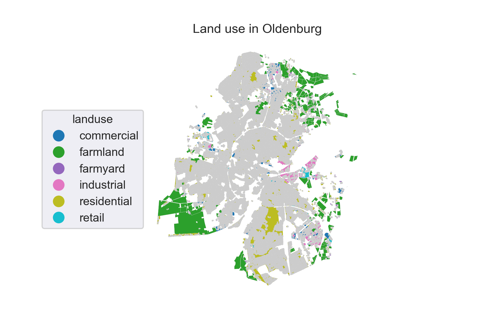
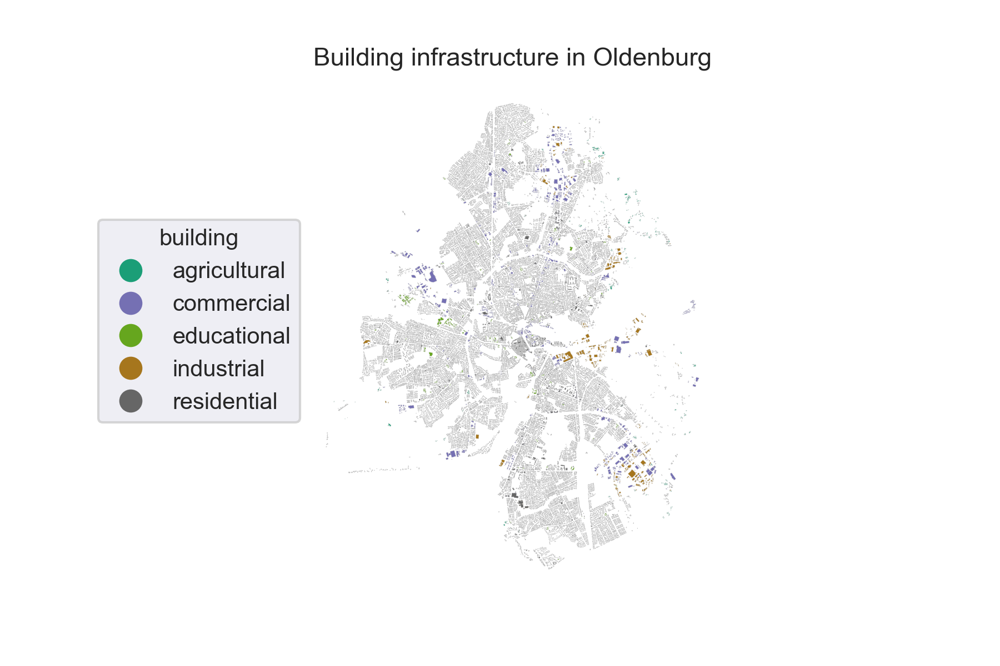

# FlexiGIS: an open source GIS-based platform for modelling energy systems and flexibility options in urban areas.

Author: Alaa Alhamwi alaa.alhamwi@dlr.de

Organisation: German Aerospace Center (DLR) Institute of Networked Energy Systems https://www.dlr.de/ve/

Date: 13.12.2019

Copyright: FlexiGIS code is licensed under the 3-Clause BSD License https://opensource.org/licenses/BSD-3-Clause

FlexiGIS stands for Flexibilisation in Geographic Information Systems (GIS). It extracts, filters and categorises the geo-referenced urban energy infrastructure, simulates the local electricity consumption and power generation from on-site renewable energy resources, and allocates the required decentralised storage in urban settings. FlexiGIS investigates systematically different scenarios of self-consumption, it analyses the characteristics and roles of flexibilisation technologies in promoting higher autarky levels in cities. The extracted urban energy infrustructure are based mainly on OpenStreetMap data.

The OpenStreetMap (OSM) data is available under the Open Database License (ODbL). A description of the ODbL license is available at the webpage http://opendatacommons.org/licenses/odbl. OpenStreetMap cartography is licensed as CC BY-SA. For more information on the copyright of OpenStreetMap please visit the link http://www.openstreetmap.org/copyright. The OpenStreetMap data distributed is available under the Open Database License ODbL.

The FlexiGIS code is licensed under the BSD-3-Clause, "New BSD License" or "Modified BSD License". Redistribution and use in source and binary forms, with or without modification, are permitted. For more information concerning the BSD-3C and the description of the terms under which you can use the FlexiGIS code, please visit https://opensource.org/licenses/BSD-3-Clause.

# FlexiGIS Components

## Module I: FlexiGIS urban spatial platform

This package establishes urban energy infrastructure. It extracts, acquires and processes urban georeferenced data extracted from OpenStreetMap. In order to extract the OpenStreetMap georeferenced datasets of urban energy infrustructure datasets and its required features, Module I derives an automatised extraction procedure. Firstly, the raw OpenStreetMap data is downloaded from the OpenStreetMap database for the invistigated urban space from `Geofabrik`. Second, the OpenStreetMap datasets are filtered for the respective case study defined by the provided `.POLY` file using the open source java tool `osmosis`. The OpenStreetMap data are filtered for the follwoing OSM elements: 
* `landuse = *` provides information about the human use of land in the respective area (See Figure 1)
* `building = *` describes all mapped objects considered as buildings of different types like houses, schools ... (See Figure 2) 
* `highway = *` tag describes all lines considered as streets, roads, paths, etc. (See Figuer 3)


Fig. 1. Extracted OpenStreetMap `landuse` datasets for the city of Oldenburg. Credits: OpenStreetMap contributors.


Fig. 2. Extracted OpenStreetMap `building` datasets for the city of Oldenburg. Credits: OpenStreetMap contributors.


Fig. 3. Extracted OpenStreetMap `highway` datasets for the city of Oldenburg. Credits: OpenStreetMap contributors.

After filtering the OSM raw data, the georeferenced building and roard infrastructure in the city of Oldenburg are exported to a relational postgis-enabled database using the open source `osm2pgsql`. Theses datasets can be exported as CSV files or visualised as maps (see Figures 1-3).

## Module II: FlexiGIS temporal dimension

It simulates urban energy requirments (consumption and generation). The spatio-temporal electricity consumption and renewable
energy generation from PV and wind in the defined urban area are modelled. This component models the combined spatial parameters of urban geometries (Module I) and linkes them to real-world applications using GIS. Here, a bottom-up simulation approach is developed to calculate local urban electricity demand and power generation from available renewable energy resources. For instance, using open source datases like Standardised Load Profiles and publicaly available weather data, Fig. 4 shows the generated quarter-hourly time series of the aggregated load and PV power supply profile for invistigated case study.


Fig. 4. Simulated electricity consumption (green) and solar power generation (red) for the city of Oldenburg.

## Module III: Optimisation of flexibility options

The spatial-temporal simulation outputs from Module I and II are highly resolved time series of electricity demand and supply. Theses generated datasets will be used by the `urbs` model as inputs to the linear optimisation problem. This module aims to determine the minimum system costs at the given spatial urban scale while matching simultenously the simulated electricity demand. In addition, it aims to allocate and optimise distributed storage and other felecibility options in urban energy systems.

This component will be explained in details. The codes, scripts and coupling of urbs model and FlexiGIS platform will be added.

## System requirements
FlexiGIS is developed and tested on Linux (Ubuntu 16.04.6). The tools and software used in FlexiGIS and their versions are listed in the following:

* Operating system: Ubuntu 16.04.6 LTS, Release: 16.04, Codename: xenial
* PostgreSQL version: 11.2 (64-bit)
* PostGIS version: 1.5.3
* osmosis version: 0.44.1
* osm2pgsql version: 0.88.1 (64bit id space)
* GNU Make version: 4.2.1
* Python: 3.6.7
* GNU bash: 4.3.48(1)-release (x86_64-pc-linux-gnu)


PostgreSQL: To install PostgreSQL, refer to the webpage: http://www.postgresql.org/. Please note that you need at least the version or higher to run FlexiGIS.

Osmosis: To use Osmosis, unzip the distribution (which can be obtain from the webpage: http://wiki.openstreetmap.org/wiki/Osmosis) in the location of your choice. On unix/linux systems, make the bin/osmosis script executable (ie. chmod u+x osmosis). If desired, create a symbolic link to the osmosis script somewhere on your path (eg. ln -s appdir/bin/osmosis ~/bin/osmosis).

osm2pgsql: Instruction are available on how to download and install osm2pgsql for Linux systems on the webpage: http://wiki.openstreetmap.org/wiki/Osm2pgsql.

Python: Ensure you can run python (with version 3 and above) on your OS. Python can be downloaded following this link https://www.python.org/downloads/ or Anaconda distro from https://www.anaconda.com/distribution/ .

## Getting Started
To use the FlexiGIS spatial-temporal platform (Module I and II) download the FlexiGIS code and data folder as a zip file or clone the repository from the FlexiGIS GitHub repo. After downloading the FlexiGIS code, unzip the folder FlexiGIS in the location of your choice. The file structure of the FlexiGIS code folder is as follows:

* FlexiGIS
    * ├── code
    * ├── data
    * │   ├── 01_raw_input_data
    * │   ├── 02_urban_output_data
    * │   │   └── temp
    * │   ├── 03_urban_energy_requirements
    * │   └── 04_Visualisation
    * ├── doc
    * │   ├── AUTHOR
    * │   ├── BSD License.pdf
    * │   ├── COPYING
    * │   ├── LICENSE
    * │   ├── README.md
    * └── requirements.txt

  
## Installation
After making sure that all system requirements are satisfied, clone the FlexiGIS repository using:

```
git clone _FlexiGIS repository_ from GitHub
```

In a next step, create a Python virtual environment (give a name e.g. _env_name) where the required python dependencies can be installed using pip. 

```
python3 -m venv _env_name
``` 

Then, activate the virtual environment:

```
source virtual_env_name/bin/activate
```

Python virtual environment can be created by following the steps from https://packaging.python.org/tutorials/installing-packages/. After creating a python virtual environment, cd into the unzipped or cloned FlexiGIS directory

```
cd ../FlexiGIS
```

install the required python dependencies by running:

```
pip install -r requirements.txt
```
Now you are ready to excute FlexiGIS (Please note, that this applies for both Module I and II).

##### FlexiGIS directory description

`code:` The folder code contains a "makefile" for running the FlexiGIS model and the configuration file "config.mk". The "config.mk" file contains different parameters necessary
 to run the FlexiGIS model.

`data:` The folder data contains or should contain all the data needed and generated by the FlexiGIS code. The FlexiGIS code is provided with the input and output data of the FlexiGIS model. The folder data contains 4 sub folders, which are introduced as follows:

The folder 01_raw_input_data contains the poly file of the respective invistegated urban area (e.g. Oldenburg.poly). The poly file is used to filter the OSM planet datasets to include the data of case study. This is achieved by Osmosis and executed by "make filter_data". The OSM planet data is filtered spatially to include urban infrastructure like `building`, `highway` and `landuse`. This folder should contain the OSM planet data file. It is not included in the present distribution of FlexiGIS because of its size. It can be downloaded from: http://ftp5.gwdg.de/pub/misc/openstreetmap/planet.openstreetmap.org/planet.* The the resulting filtered OSM power data is stored in folder 01_raw_input_data. An example is provided with the FlexiGIS code as file niedersachsen-latest.osm.pbf.

Urban style data "urban.style", Weather data "weather-data.csv", Standard load profile data "SLP.csv" which are all input data are also saved in the 01_raw_input_data directory.

The resulting abstracted urban infrastructure based on landuse category: agriculture, education, commercial, residential,industrial and highway, are generated and saved as .csv data files in the
 02_urban_output_data directory. The temp directory is created inside 02_urban_output_data when the code is run to store temporary generated files, which are used by the code. The contents in the temp directory are deleted automatically after the abstraction is complete.

In 03_urban_energy_requirements directory, aggregated load and PV data for the urban infrastructure are saved as output csv. Also the load time series for different urban infrastructure (according to landuse) are  saved as output csv files.
Plots of the abstracted urban infrastructure and aggregated load and PV requirements are saved in folder 04_visualization.

`doc:` A primary user guide of the FlexiGIS code and model  is provided in the folder doc.

## Running FlexiGIS

To run the first two components of the FlexiGIS platform (Module I and II), execute the following steps:

1. Download the FlexiGIS folder and unzip it in the location of your choice.

2. Go to the folder code, check the parameters in config.mk file.

###### The available makefile options are:
```
a. $ make
```
make all executes make commands for the OSM data, from download to the simulation of load and PV profiles for the urban infrastructures.

```
b. $ make download
```
make download, downloads spatial OSM data of a given location
```
c. $ make filter_data
```
filter the downloaded OSM data
```
d. $ make export_data
```
exports the spatially filtered OSM data to a PostgreSQL database
```
e. $ make abstract_data
```
extract highway, building and landuse data from filtered OSM data
```
g. $ make demand_supply_simulation
```
executes the simulation of load and PV profiles for urban infrastructure
```
h. $ make drop_database
```
provides option to either drop the database or not.
```
i. $ make example
```
make example can be run to generate an example simulation of aggregated load and PV profile for Oldenburg. The example imports spatially filtered OSM Highway, landuse and building data stored as csv files in the ../data/01_raw_input_data/example_OSM_data folder. In other words, it runs steps e and g using the provided example data.

3. After running the FlexiGIS model using the makefile, the resulting aggregated load and PV profiles, urban infrastructure data are stored as .csv data in folder data/03_urban_energy_requirements.
https://github.com/FlexiGIS/FlexiGIS.git

## Documentation

A detailed documentation of the FlexiGIS code will be available in the user guide (in folder doc) and the Read the Docs https://readthedocs.org/. The documentation will include detailed information about the FlexiGIS code structure, how to run the FlexiGIS model. Moreover, it will provide description about all the simplifications and assumptions of the FlexiGIS model as well as information about how the OSM data are used.

## FlexiGIS publications list:

#### Alhamwi et. al, *GIS-based urban energy systems models and tools: Introducing a model for the optimisation of flexibilisation technologies in urban areas*, Applied Energy, Volume 191, 1-9 (2017), 10.1016/j.apenergy.2017.01.048, https://doi.org/10.1016/j.apenergy.2017.01.048.

#### Alhamwi et. al, *OpenStreetMap data in modelling the urban energy infrastructure: a first assessment and analysis*, Energy Procedia, Volume 142, 1968–1976 (2017), 10.1016/j.egypro.2017.12.397, https://doi.org/10.1016/j.egypro.2017.12.397.

#### Alhamwi et. al, *Modelling urban energy requirements using open source data and models*, Applied Energy, Volume 231, 1100-1108 (2018), 10.1016/j.apenergy.2018.09.164, https://doi.org/10.1016/j.apenergy.2018.09.164.

#### Alhamwi et. al, *FlexiGIS: an open source optimisation platform for the optimisation of flexibility options in urban energy systems*, Energy Procedia, Volume 152, 941-949 (2018), 10.1016/j.egypro.2018.09.097, https://doi.org/10.1016/j.egypro.2018.09.097.

#### Alhamwi et. al, *Development of a GIS-based platform for the allocation and optimisation of distributed storage in urban energy systems*, Applied Energy, Volume 251, 113360 (2019), 10.1016/j.apenergy.2019.113360, https://doi.org/10.1016/j.apenergy.2019.113360.

#### Ranalli and Alhamwi, *Configurations of renewable power generation in urban energy systems using open source data and models: with case study in Philadelphia*, Applied Energy, (2020), under review.

#### Alhamwi et. al, *Modelling urban street lighting infrastructure using open source data*, to be submitted to IEEE Access, (2020).


## Help

In case of any questions, comments or suggestions please do not hesitate to contact us by email via `flexigis.developers(at)dlr.de`.

If you would like to be informed about developments from within the project and the availability of new software and releases please register for our newsletter by sending an email to: `flexigis-subscribe(at)dlr.de`.

## Contributors
Project team:

Dr. Wided Medjroubi (project leader)

Dr. Alaa Alhamwi (FlexiGIS main author)

MSc. Chinonso C. Unaichi

## Contact

Contact email: `flexigis.developers(at)dlr.de`.
