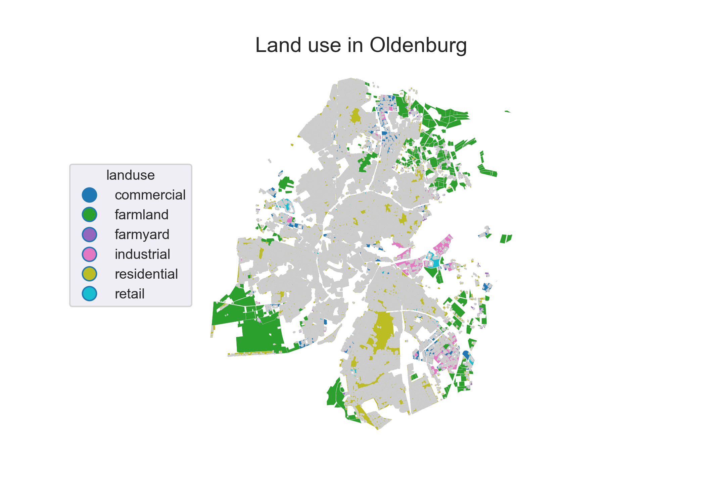
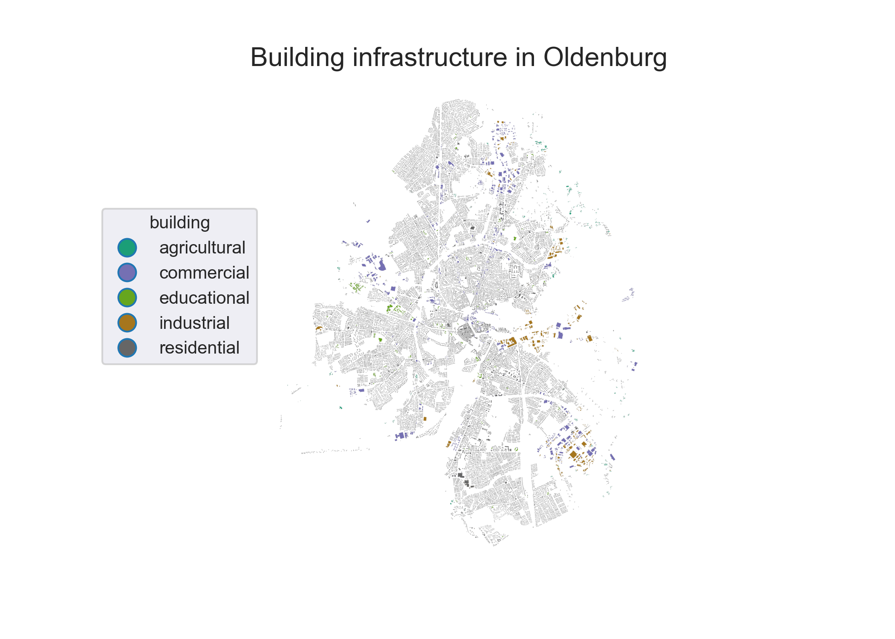
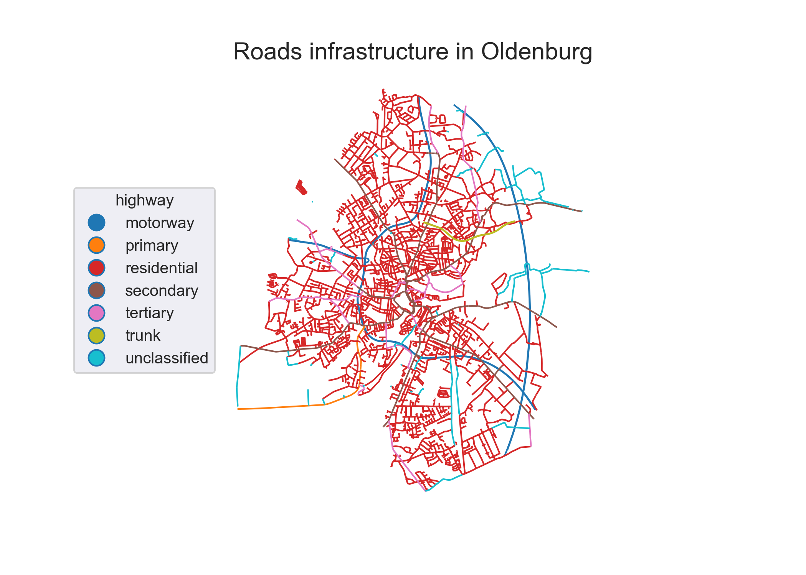

.. module:: FlexiGIS

.. _Module I:

Module I: Spatial urban energy system platform
================================================
This module establishes urban energy infrastructure. It extracts, acquires
and processes urban geo-referenced data extracted from `OpenStreetMap`_.
In order to extract the `OpenStreetMap`_ georeferenced datasets of urban energy
infrastructure and its required features, this module derives an automatised
extraction procedure. Firstly, the raw `OpenStreetMap`_ data is downloaded from
the `OpenStreetMap`_ database for the investigated urban space from `Geofabrik`_.
Second, the `OpenStreetMap`_ datasets are filtered for the respective case study
defined by a .poly file using `osmosis`_, an open source java tool.
The `OpenStreetMap`_ data are filtered for the following OSM tags: landuse,
building, and highway.

.. note::

   * `landuse`:
        provides information about the human use of land in the respective area (see `Figure 1`_)
   * `building`:
        describes all mapped objects considered as buildings of different types. e.g houses, schools, etc. (see `Figure 2`_)
   * `highway`:
        describes all lines considered as streets, roads, paths, etc. (see `Figure 3`_)

After filtering the OSM raw data, the geo-referenced building and highway infrastructure
(case study: the city of Oldenburg) are exported to a relational postgis-enabled database using
the open source `osm2pgsql`. Theses datasets can be exported as .csv files or visualised
as maps (see Figures 1-3).

.. _Figure 1:

    Extracted OpenStreetMap `landuse` datasets for the city of Oldenburg.
    Credits: OpenStreetMap contributors.

.. _Figure 2:

    Extracted OpenStreetMap `building` datasets for the city of Oldenburg.
    Credits: OpenStreetMap contributors.

.. _Figure 3:

    Extracted OpenStreetMap `highway` datasets for the city of Oldenburg.
    Credits: OpenStreetMap contributors.

.. _OpenStreetMap: http://www.OpenStreetMap.org
.. _Geofabrik: https://download.geofabrik.de
.. _osmosis: http://wiki.OpenStreetMap.org/wiki/Osmosis
